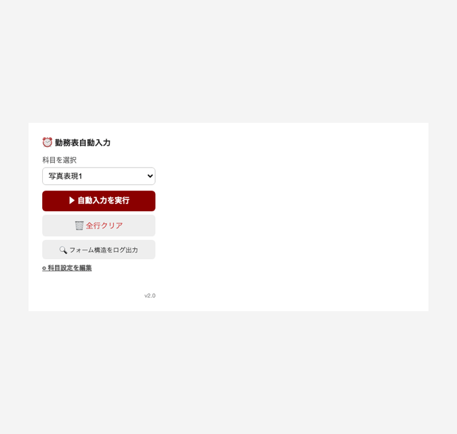

# 早稲田 勤務表自動入力 Chrome拡張

早稲田大学の勤務表（wpte.waseda.jp）に、あらかじめ登録した科目の開始・終了時刻や従事内容チェックを自動入力するChrome拡張機能です。YAML形式で科目を登録するだけで、複数科目・複数曜日にまとめて対応できます。 <br/>


## インストール手順

1. GitHubからZIPファイルをダウンロード：
   1. GitHubリポジトリのページで緑色の「Code」ボタンをクリック
   2. ドロップダウンメニューから「Download ZIP」を選択
   3. ダウンロードしたZIPファイルを適当な場所に解凍

2. Google Chromeを開き、アドレスバーに以下を入力します：
   ```
   chrome://extensions/
   ```

3. 右上の「デベロッパーモード」をONにします

4. 左上に表示される「パッケージ化されていない拡張機能を読み込む」をクリックします

5. 解凍したフォルダ（`waseda-autofill`）を選択します
> [!IMPORTANT] フォルダに注意！
> `manifest.json`が直下にあるフォルダ（`waseda-autofill`フォルダそのもの）を選択してください

6. 拡張機能が正しく読み込まれると、Chrome拡張機能の一覧に「早稲田 勤務表自動入力」が表示されます

7. 拡張機能アイコンをツールバーに固定しておくと使いやすくなります（パズルピースアイコン→ピン留め）

## 使用方法（初回設定）

1. Chrome拡張機能のアイコンをクリックし、「⚙ 科目設定を編集」を押して設定画面を開きます

2. 表示されたテキストエリアに、YAML形式で科目情報を入力します

   ```yaml
   - name: 写真表現1
     subject: 写真表現1
     excluded: "0000"
     Wed: 1000-1400
     Thu: 1000-1500
     codes: B12, B15, B18, B20, B21, B22, D41, D43, D44

   - name: 基礎演習B
     subject: 基礎演習B
     excluded: "0000"
     Mon: 0900-1200
     codes: B12, B15
   ```

   | 項目 | 内容 |
   |---|---|
   | `name` | ポップアップの選択肢に表示される科目名 |
   | `subject` | 勤務表の「科目」欄に入力される文字列 |
   | `excluded` | 「除外時間」欄に入力される値 |
   | `Mon`〜`Sun` | 曜日ごとの勤務時間（`開始-終了`、例：`1000-1400`） |
   | `codes` | チェックを入れる従事内容コード（カンマ区切り） |

> [!TIP]
> ChatGPTなどのAIに「以下のフォーマットで○○の設定を作って」と頼むと、YAMLを生成してもらえます。

3. 「✔ プレビュー確認」を押すと、パース結果が表として確認できます

4. 内容に問題がなければ「💾 保存」を押して保存します

## 使用方法（毎回の入力）

1. wpte.waseda.jpの勤務表入力画面を開きます

2. 拡張機能アイコンをクリックしてポップアップを開きます

3. 「科目を選択」から入力したい科目を選びます

4. 「▶ 自動入力を実行」を押すと、該当する曜日の行に時刻・除外時間・科目・チェックが自動入力されます

5. 入力をやり直したい場合は「🗑 全行クリア」で全行をクリアできます

6. うまく入力されない場合は「🔍 フォーム構造をログ出力」を押し、開発者ツールのコンソール（F12）でフォーム構造を確認できます

## トラブルシューティング

- 拡張機能が表示されない場合：
  - デベロッパーモードが有効になっているか確認してください
  - 選択したフォルダに`manifest.json`が含まれているか確認してください
  - Chromeを再起動してみてください

- 自動入力が実行されない・一部しか入力されない場合：
  - 勤務表のページを開いた状態で実行しているか確認してください
  - 「⚙ 科目設定を編集」でYAMLの曜日・時刻の書式（例：`Wed: 1000-1400`）が正しいか確認してください
  - 「🔍 フォーム構造をログ出力」の結果をコンソールで確認し、フォームの構造が変わっていないか確認してください

- エラーが表示される場合：
  - Chromeの拡張機能ページで「エラー」リンクからエラー内容を確認してください
  - 必要なファイルがすべて正しい場所にあるか確認してください

## 開発者向け情報

拡張機能の構造：
```
waseda-autofill/
├── manifest.json      # 拡張機能の設定（Manifest V3）
├── popup.html         # ポップアップ（自動入力実行画面）
├── popup.js           # 自動入力・クリア・デバッグ処理
├── options.html        # 科目設定（YAML編集）画面
├── options.js          # YAML保存・プレビュー処理
└── yaml-parser.js      # 軽量YAMLパーサー（外部ライブラリ不使用）
```

## サポート

問題や提案がある場合は、GitHubのIssueトラッカーを使用してください。
